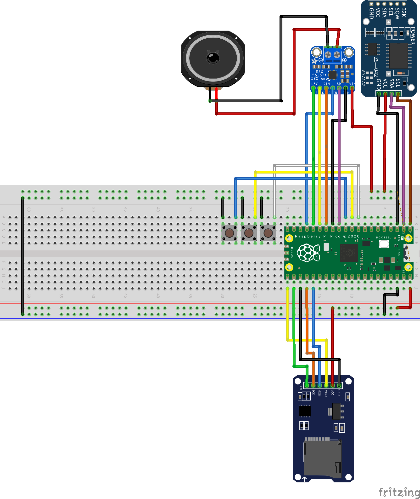
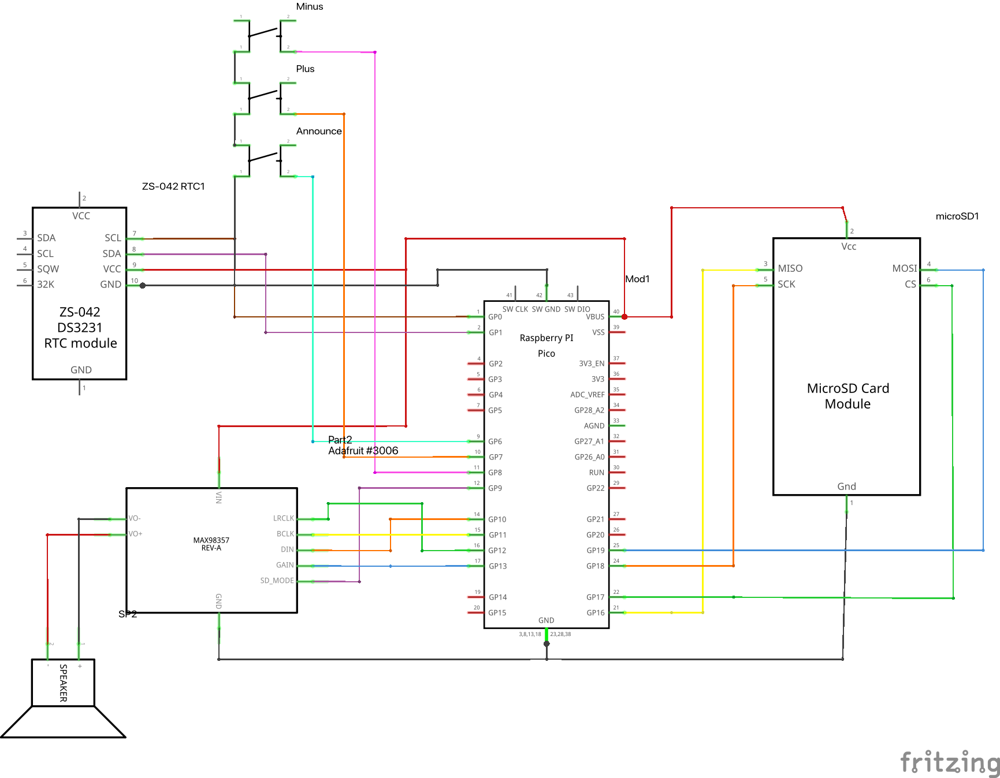

# Talking Clock Electronics

This document covers the electronic components, wiring, and known hardware gotchas for the Talking Clock project.

- [Talking Clock Electronics](#talking-clock-electronics)
  - [Overview](#overview)
  - [Bill of Materials](#bill-of-materials)
  - [Wiring](#wiring)
  - [Known Hardware Gotchas](#known-hardware-gotchas)

## Overview

The clock is built around a Raspberry Pi Pico (RP2040) running CircuitPython. A DS3231 RTC module keeps accurate time over power cycles. Audio is generated by the Pico and driven through a MAX98357A I2S amplifier to a small full-range speaker. Three buttons provide the user interface. All voice audio and configuration files are stored on an SD card.

All components are off-the-shelf and sourceable from standard electronics suppliers. No custom PCB is required.

## Bill of Materials

### Electronics

| Part | Specifications | Notes | Link |
| ---- | -------------- | ----- | ---- |
| Raspberry Pi Pico | RP2040 | Pico or Pico W | |
| SPI SD Card Reader | 3.3V-5V Level Shifted | | [TinyTronics 000375](https://www.tinytronics.nl/en/data-storage/modules/microsd-card-adapter-module-3.3v-5v-with-level-shifter) |
| I2C DS3231 RTC Module | | Requires CR2032 battery | [TinyTronics 005849](https://www.tinytronics.nl/en/sensors/time/keyestudio-ds3231-rtc-module-i2c) |
| CR2032 Battery | | For RTC backup power | |
| I2S MAX98357A Amplifier | 3W | Clones available | [Adafruit 3006](https://www.adafruit.com/product/3006) |
| Mono Speaker | 4 ohm 3W full-range | Enclosed speaker has superior sound | |
| Arcade Button | 30mm | Main ANNOUNCE button | [Kiwi Electronics](https://www.kiwi-electronics.com/en/30mm-arcade-button-black-3860) |
| Momentary Push Button Switch | Panel Mount 37x14x14mm | 2x required, PLUS and MINUS | [Conrad.com](https://www.conrad.com/en/p/tru-components-tc-dt310ws-tc-dt310ws-pushbutton-momentary-1-pc-s-1589423.html) |
| 2.54mm Pitch Strip Board | | For VCC/GND bus bar | |
| 2.54mm Pin Headers | 2x9 | Bus bar for VCC and GND | |

## Wiring





[Fritzing](https://fritzing.org/download/) [`talking_clock.fzz`](./talking_clock.fzz)

### Pin assignments

| Signal | Pico Pin | Notes |
| ------ | -------- | ----- |
| I2C SDA (RTC) | GP0 | |
| I2C SCL (RTC) | GP1 | |
| I2S Data | GP10 | MAX98357A DIN |
| I2S Bit Clock | GP11 | MAX98357A BCLK |
| I2S Word Select | GP12 | MAX98357A LRC |
| Amp GAIN | GP13 | Driven high for 9dB gain |
| SD MISO | GP16 | |
| SD CS | GP17 | |
| SD CLK | GP18 | |
| SD MOSI | GP19 | |
| ANNOUNCE Button | GP6 | Pulled up, active low |
| PLUS Button | GP7 | Pulled up, active low |
| MINUS Button | GP8 | Pulled up, active low |
| Amp SD (shutdown) | GP9 | Must be driven high |

### Bus bar

A 2x9 pin header soldered to strip board provides a shared VCC and GND bus for components that do not terminate directly at the Pico. One column carries 3.3V and the other carries GND. The push button switches and any other components requiring a common ground connect here.

## Known Hardware Gotchas

### MAX98357A SD pin must be driven high

The SD pin on the MAX98357A controls the shutdown state of the amplifier. If left floating, the pin state is undefined and the amplifier will intermittently shut down, producing random pops and dropouts that are easy to mistake for a software or speaker problem.

GP9 must be configured as an output and driven high at boot before any audio is played:

```python
sd = digitalio.DigitalInOut(board.GP9)
sd.direction = digitalio.Direction.OUTPUT
sd.value = True
```

### I2C pin assignment

The DS3231 RTC uses I2C on GP0 and GP1. The assignment is SCL on GP1 and SDA on GP0, which is the reverse of what some wiring diagrams show. Using the wrong assignment will cause the RTC to fail silently at boot.

### GAIN pin configuration

The MAX98357A GAIN pin sets the amplifier gain. Leaving it floating selects 9dB gain, which is appropriate for this application. Do not connect GAIN to GND (15dB) or VDD (12dB) unless you have a specific reason to change the gain level.

### Speaker selection

Sensitivity and enclosure matter as much as power rating. A speaker rated at 85 dB/W/m or better in a proper full-range enclosure will sound significantly better than a bare driver of the same wattage. The high-pass filter in the audio generation pipeline removes low-frequency content that small drivers cannot reproduce, but it cannot compensate for a poorly chosen or unenclosed speaker.