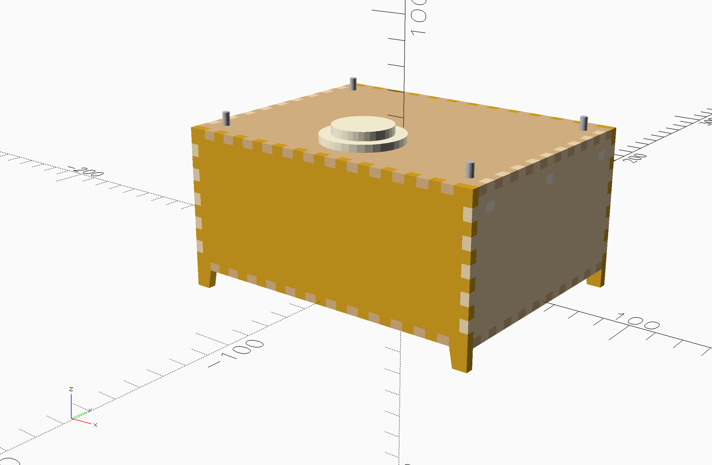
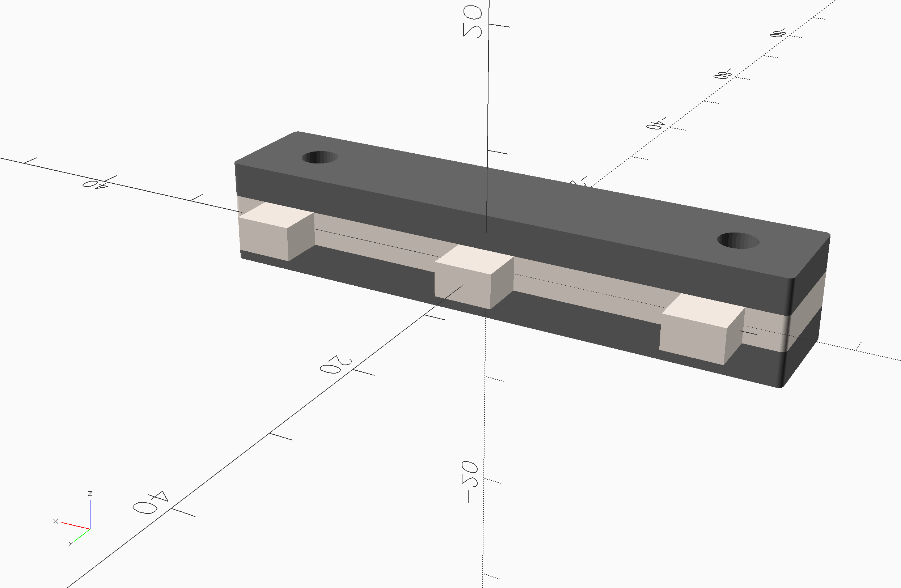
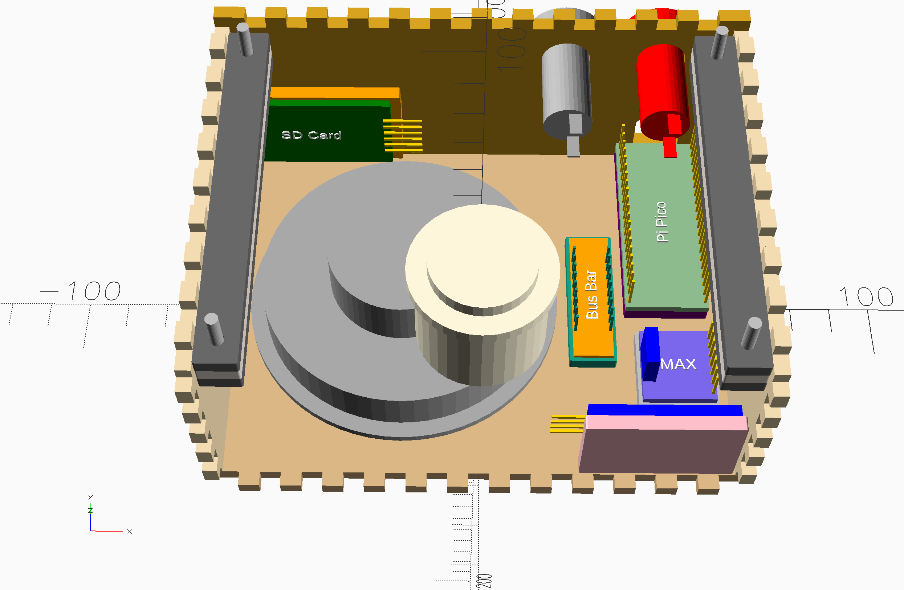

# Prototype Clock Enclosure

Speaking Clock Enclosure

The prototype enclosure can be laser cut and assembled only with glue and some basic tools. The design is not beginner friendly and is a starting point for future designers.

**NOTE:** The [`clock.scad`](./clock.scad) file that is provided is set up for a 3D view. The front and top panels are commented out. This is to aide in visualizing placement of components. The missing panels in the 3D rendering will not affect the rendering of the 2D SVG for cutting.

## Laser Cut Enclosure

This model is provided as a customizable OpenSCAD model. It can be customized to work with any thickness plywood, but works best with 3.5-4.0mm wood. Switch openings, speaker grill and other features are all customizable. See the relevant headings in the OpenSCAD code.

Before cutting this, check your material thickness and update the material thickness under the *Enclosure Dimensions* heading. All values are provided in millimeters.

To prepare for laser cutting do the following:

1. Adjust the material thickness value either in the code or the [OpenSCAD Customizer](https://en.wikibooks.org/wiki/OpenSCAD_User_Manual/Customizer)
2. Set rendering mode `three d` to `0` 
3. In the OpenSCAD interface, choose **Design > Render** to produce a valid, exportable 2D object
4. Finally save the design as an SVG with **File > Export > SVG**

The resulting SVG file has a 20x10 mm benchmark rectangle in the lower right corner (Quadrant IV) that is useful for verifying that the SVG was produced with appropriate scaling.

## Assembly

### Materials

| Material               | Qty | Purpose                  | Notes                                                    |
| ---------------------- | --- | ------------------------ | -------------------------------------------------------- |
| M3x16mm Bolts          | 4   | Securing Lid             | This is based on a material thickness of 4mm             |
| M3x10mm bolts          | 2   | Securing Speaker         |                                                          |
| M3 Nuts                | 6   | Securing Lid and Speaker |                                                          |
| 4mm Laser Safe Ply     |     |                          |                                                          |
| Wood Glue              |     |                          |                                                          |
| 2.5mm screws           |     |                          |                                                          |
| 2.54 pitch strip board |     |                          |                                                          |
| Dupont Headers         | 2x9 | Bus Bar for VCC and GND  | Use fiberglass copper strip board with continuous strips |

### Procedure

#### Make a Bus Bar

You will need a 9x2 2.54 bus bar for VCC and Ground connections.

Create a bus bar using 2.54 pitch strip board with two columns of 9 pins. one side of the bus is for all 5v VCC connections and the other for ground connections that do not terminate at the Pico (e.g. push button switches).

#### Make Nut Sandwiches

Make two "nut sandwiches" using two long thin pieces with round holes and one long thin piece with two m3 sized holes and fingers.

1. Spread glue on one of the pieces with round holes
2. Add the piece with hexagonal holes and drop in an m3 nut, taking care not to get glue into the threads
3. Spread glue on the top of the middle layer and add the top layer
4. While the glue is still wet, use bolts through the holes to keep the pieces aligned
5. Clamp the pieces together using additional nuts, or a clamp
6. Set aside to dry

#### Assemble Case

1. Drill holes for speaker bolts if necessary
2. Apply glue to fingers for sides, bottom, front and back. DO NOT GLUE LID!
3. Use the small rectangular plates for mounting the various IC boards using 2.5mm screws
4. Glue the various IC boards inside the enclosure in the approximate locations shown
5. Bolt or secure speaker into case as appropriate
6. Take care to align the Pi Pico with the opening in the rear and the SD card with the card OUTSIDE the enclosure
7. Glue the Nut Sandwiches into the three holes on the top of the left and right sides
8. Secure the lid by threading a bolt through the lid and into the captive nuts

## Assemble the Wiring

See the circuit diagrams for further details regarding wiring.
